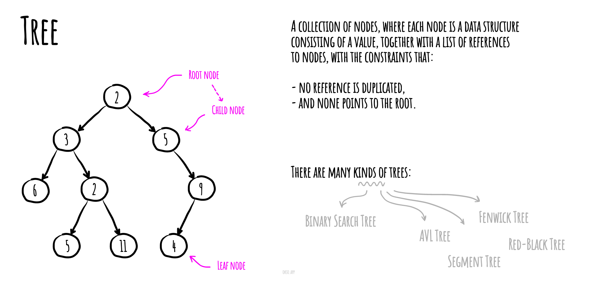

# Дерево

* [Двійкове дерево пошуку](binary-search-tree)
* [AVL Дерево](avl-tree)
* [Червоно-чорне дерево](red-black-tree)
* [Дерево сегментів](segment-tree) - з прикладами запитів до діапазонів min/max/sum
* [Дерево Фенвік](fenwick-tree) (Двійкове індексоване дерево)

У комп'ютерних науках **дерево** - це широко використовуваний абстрактний тип даних
(ADT) - або структура даних, що реалізує цей ADT, яка
імітує ієрархічну структуру дерева, з кореневим значенням
і піддеревами дочірніх елементів з батьківським вузлом, представленим як
набором пов'язаних між собою вузлів.

Деревоподібну структуру даних можна визначити рекурсивно (локально)
як сукупність вузлів (починаючи з кореневого вузла), де
кожен вузол є структурою даних, що складається зі значення,
разом зі списком посилань на вузли ("дочірні"),
з обмеженнями, що жодне посилання не дублюється, і жодне
не вказує на корінь.

Просте невпорядковане дерево; на цій діаграмі вершина з міткою 7 має
двох нащадків, позначених як 2 і 6, і одного батька, позначеного як 2.
кореневий вузол, що знаходиться у вершині, не має батька.

## Посилання

- [Wikipedia](https://en.wikipedia.org/wiki/Tree_(data_structure))
- [YouTube](https://www.youtube.com/watch?v=oSWTXtMglKE&list=PLLXdhg_r2hKA7DPDsunoDZ-Z769jWn4R8&index=8)
